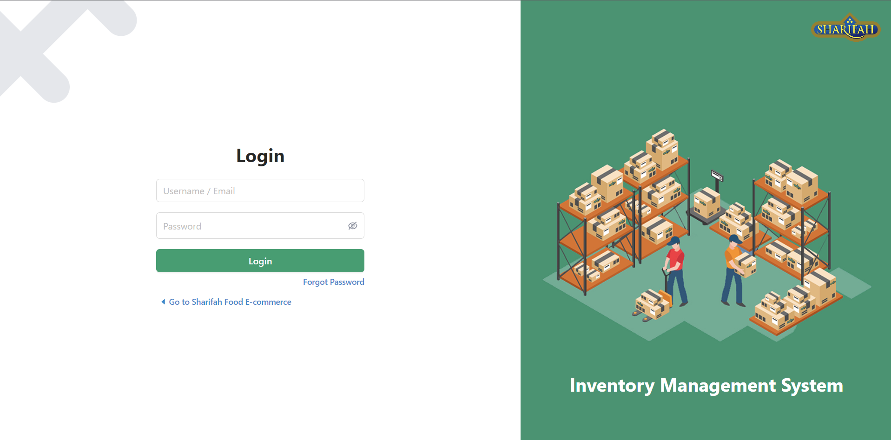
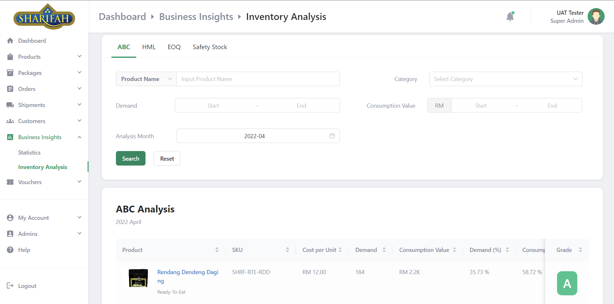

# Inventory Management System

<!-- ALL-CONTRIBUTORS-BADGE:START - Do not remove or modify this section -->

[](#contributors-)

<!-- ALL-CONTRIBUTORS-BADGE:END -->

## Overview

Sharifah Food is a food processing company that specialises in the ready meals market. Over the years, Sharifah Food had to manually take orders from its customer through WhatsApp and record the sales data in Excel sheets. Nevertheless, it was discovered that it became difficult to keep track of all sales, orders, and inventory as the company grew. Therefore, this project aims to implement a web-based computerised inventory management system that helps the company streamline the inventory management process.

#### Multi-level Marketing System

Sharifah Food applies Multi-level Marketing (MLM) system to sell its products. The customers can apply as **agents** or **dropshippers** to promote and sell the company's products by purchasing the products at discounts. For instance, an agent and a dropshipper can receive 30 percent and 20 percent discounts, respectively, if they order a large quantity of products.

## Demo :rocket:

##### NOTE: This project is only for demonstration purposes. Please do not enter any sensitive information on the website.

https://fyp-shrf.herokuapp.com/

###### \*Might take some time to wake up the system due to inactivity

### Login Credentials

Username:   uattester<br>
Password:   Testing@123

## Features

1. Login<br>
   The admin is able to log in to the inventory management system by entering their username and password.

2. Profile Management<br>
   The admins can manage their profiles and change their current password, phone number, email, gender, etc.

3. Product Stock Management<br>
   The admin can manage the product inventory, such as add new products, add new stocks to the products, modify the product information, remove the existing product, and check the products’ information.

4. Promotional Packages Management<br>
   The admin can manage the promotions by adding new promotional packages as well as modifying and deleting the existing promotional packages.

5. Order Management<br>
   The admin can view all orders from direct customers, agents and dropshippers. In addition, the admin can update the status of each order or even cancel the customers’ orders.

6. Agent and Dropshipper Management<br>
   The admin can view the lists of agents and dropshippers and their respective orders to confirm their sales performance. In addition, the admin can also view, accept and reject the applications of the agents and dropshippers.

7. Shipping Fee Management<br>
   The admin can add, edit, delete and view the shipping fee in different states. Besides, the admin can customize the shipping fee for different weight ranges. The shipping fees added will be applied to the total order amount when the customers place an order.

8. Pickup Location Management<br>
   The admin can add the pickup location for the placed orders. This allows the customers to choose whether to ship their orders to their addresses or pick up the order at the pickup location.

9. Discount Management<br>
   The admin can manage and create discount codes that can be applied while making payments on the e-commerce platform. The discount can be specified either as a percentage or a fixed amount and is customizable for various criteria such as minimum order spend, a maximum discount, customer eligibility, etc.

10. Business Insights<br>
    The admin can view the sales analysis to gain more insight into the company's business performance. Sales and inventory analyses are crucial for the business as they help cut unnecessary costs and predict the demand for products. There are many inventory analyses such as ABC analysis, HML analysis, SS analysis, EOQ analysis, etc. This system uses these analyses to provide the information for better inventory control on Sharifah Food.

11. Invoice Generator<br>
    The admin can generate an invoice for each order placed by a customer.

12. Sales Report Generator<br>
    The system can generate a sales reports in Excel format at the admin’s request.

13. Email Notification<br>
    Email notifications automatically alert the admin when new orders are placed,products are in low stock, or pending approvals for the registrations for agent and dropshipper.

## Tech Stack

- [Django (Python)](https://www.djangoproject.com/)
- [React TypeScript](https://create-react-app.dev/docs/adding-typescript/)
- [PostgreSQL (with Heroku)](https://www.postgresql.org/)
- [Redis (with Heroku)](https://redis.io/)
- [Cloudinary](https://cloudinary.com/)
- [Gmail SMTP](https://mail.google.com/mail/)
- [Ant Design](https://ant.design/)
- [LESS](https://lesscss.org/)
- [Heroku](https://www.heroku.com/)
- [Figma](https://www.figma.com/)

## System Design

### System Architecture

<br>

### Use Case Diagram

<br>

### Conceptual ERD

<br>

### Logical ERD

<br>

### Physical ERD

<br>

### Prototype Design

https://tinyurl.com/FYPInvMgmtSysPrototype

## Installation

### Prerequisites

- SQL Database
- [Cloudinary Account](https://cloudinary.com/)
- SMTP Account
- [Redis](https://redis.io/)
- [Python 3.10.2](https://www.python.org/downloads/release/python-3102/)
- [Yarn](https://yarnpkg.com/)

### Installation Steps

1. Install the frontend packages using yarn.
   ```
    yarn install
   ```
2. Install the backend packages using pip from requirements.txt.
   ```
   pip install -r requirements.txt
   ```
3. Create .env to configure environment variables as follows:
   ```
   ALLOWED_HOSTS=<any hosts seperated by ","> ('127.0.0.1,localhost')
   CORS_ORIGIN_WHITELIST=<any origin seperated by ","> ('http://localhost:3000,http://127.0.0.1:3000')
   CSRF_TRUSTED_ORIGINS=<any origin seperated by ",">
   CLOUDINARY_NAME=<your cloudinary name>
   CLOUDINARY_API_KEY=<your cloudinary api key>
   CLOUDINARY_API_SECRET=<your cloudinary api secret>
   DATABASE_NAME=<your database name>
   DATABASE_USER=<your database user>
   DATABASE_PASSWORD=<your database password>
   DATABASE_HOST=<your database host>
   DATABASE_PORT=<your database port>'
   DEBUG=True
   EMAIL_HOST_USER=<your email to send notification>
   EMAIL_HOST_PASSWORD=<your email SMTP password>
   REDIS_TLS_URL=<your Redis TLS url>
   REDIS_URL=<your Redis url>
   SECRET_KEY=<django app secret key>
   WKHTMLTOPDF_BINARY='wkhtmltopdf-pack'
   ```
4. Migrate your database.
   ```
   python manage.py migrate
   ```
5. Build the React App using yarn.
   ```
   yarn build
   ```
6. Run the server.
   ```
   python manage.py runserver
   ```

## Preview

1. Login <br> <br><br>
2. Dashboard <br> <br><br>
3. Product Management <br> <br><br>
4. Promotional Packages Management <br> <br><br>
5. Order Management <br> <br><br>
6. Customer Management <br> <br><br>
7. Agent/Dropshipper Registration Management <br> <br><br>
8. Shipping Fee Management <br> <br><br>
9. Pickup Location Management <br> <br><br>
10. Voucher Management <br> <br><br>
11. Business Insights - Statistics <br> <br><br>
12. Business Insights - Inventory Analysis <br> <br><br>
13. Profile Management <br> <br><br>
14. Account Settings <br> <br><br>
15. Invoice Generated <br> <br><br>
16. Notification <br> <br><br>

## Documentation

### Poster

https://tinyurl.com/FYPInvMgmtSysPoster

### Report

https://tinyurl.com/FYPInvMgmtSysReport

## Contributors ✨

Thanks goes to these wonderful people ([emoji key](https://allcontributors.org/docs/en/emoji-key)):

<!-- ALL-CONTRIBUTORS-LIST:START - Do not remove or modify this section -->
<!-- prettier-ignore-start -->
<!-- markdownlint-disable -->
<table>
  <tr>
    <td align="center"><a href="https://github.com/yuanjie8629"><br /><sub><b>Tan Yuan Jie</b></sub></a><br /><a href="#a11y-yuanjie8629" title="Accessibility">️️️️♿️</a> <a href="#question-yuanjie8629" title="Answering Questions">💬</a> <a href="https://github.com/yuanjie8629/Inventory Management System/issues?q=author%3Ayuanjie8629" title="Bug reports">🐛</a> <a href="https://github.com/yuanjie8629/Inventory Management System/commits?author=yuanjie8629" title="Code">💻</a> <a href="#data-yuanjie8629" title="Data">🔣</a> <a href="#design-yuanjie8629" title="Design">🎨</a> <a href="https://github.com/yuanjie8629/Inventory Management System/commits?author=yuanjie8629" title="Documentation">📖</a> <a href="#eventOrganizing-yuanjie8629" title="Event Organizing">📋</a> <a href="#ideas-yuanjie8629" title="Ideas, Planning, & Feedback">🤔</a> <a href="#infra-yuanjie8629" title="Infrastructure (Hosting, Build-Tools, etc)">🚇</a> <a href="#maintenance-yuanjie8629" title="Maintenance">🚧</a> <a href="#mentoring-yuanjie8629" title="Mentoring">🧑‍🏫</a> <a href="#platform-yuanjie8629" title="Packaging/porting to new platform">📦</a> <a href="#plugin-yuanjie8629" title="Plugin/utility libraries">🔌</a> <a href="#projectManagement-yuanjie8629" title="Project Management">📆</a> <a href="#research-yuanjie8629" title="Research">🔬</a> <a href="https://github.com/yuanjie8629/Inventory Management System/pulls?q=is%3Apr+reviewed-by%3Ayuanjie8629" title="Reviewed Pull Requests">👀</a> <a href="#security-yuanjie8629" title="Security">🛡️</a> <a href="#talk-yuanjie8629" title="Talks">📢</a> <a href="https://github.com/yuanjie8629/Inventory Management System/commits?author=yuanjie8629" title="Tests">⚠️</a> <a href="#tool-yuanjie8629" title="Tools">🔧</a> <a href="#userTesting-yuanjie8629" title="User Testing">📓</a></td>
  </tr>
</table>

<!-- markdownlint-restore -->
<!-- prettier-ignore-end -->

<!-- ALL-CONTRIBUTORS-LIST:END -->

This project follows the [all-contributors](https://github.com/all-contributors/all-contributors) specification. Contributions of any kind welcome!
